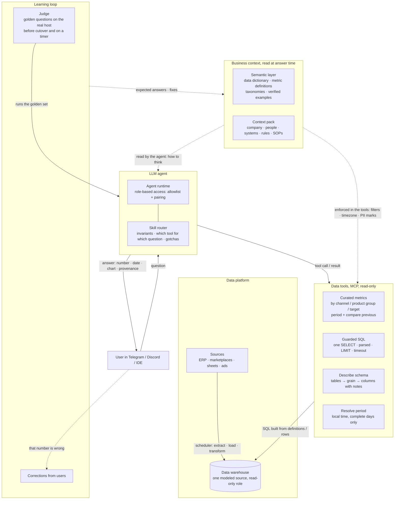

# Agentic BI

Ask your data warehouse a question in chat. Get the number, the chart, and the date it is true for.

Not a replacement for the dashboard. The dashboard answers the questions you planned; this answers the one you have at 9 am.

## Depends on

- **Lightweight data warehouse**: something queryable with SQL, modeled, one place. Without it the agent is guessing across spreadsheets.
- **Semantic layer**: metric definitions, grain, timezone, taxonomies, written once. This is the component that makes agentic BI honest. Install it first or at the same time.
- **Chat agent with role-based access**: the surface people actually use, with an allowlist so a finance question cannot be answered in the sales group.
- Recommended alongside: **LLM judge**, a golden question set run before every deploy.

## Proven outcome

Same bot, same host, two rounds each, with and without its context layer (the semantic rules it reads):

| | correct | avg time per question |
|---|---|---|
| with | 6/6, 6/6 | 21 s |
| without | 5/6, 5/6 | 34 s |

The one miss without it was a rule that existed nowhere else: an operator-confirmed warehouse-code to store mapping. Without the layer the bot answered from a downstream column and could not explain itself. With it, answers were 40% faster, shorter, and cited the rule id.

A second finding from the same run: the host held the same semantics three times (a rules folder, a skill file, the report SQL) and two of the copies already disagreed. The layer is not only for the bot. It is where the disagreement becomes visible.

## Pitfalls

- **Letting the model write free SQL with no grain rules.** Line-item tables repeat order-level columns on every row. A naive `SUM(price)` over-counts by the number of lines per order. Fix: curated tools for the recurring metrics, built server-side from the definitions, so the model cannot get the grain, the cancelled filter, or the timezone wrong. Raw SQL stays available but guarded (single `SELECT`, AST-validated, `LIMIT` injected, timeout).
- **UTC timestamps, local business days.** Bucketing `created_at::date` in UTC shifts a Bangkok day by seven hours. Pin the session timezone in the tool, never in the prompt.
- **"Past week" that includes today.** Partial days give non-reproducible answers. Define named periods once (rolling 7 complete days, ISO weeks) and expose one `resolve_period` tool that everything else calls.
- **No freshness stamp.** An answer without "data as of" is wrong the day the pipeline stalls and nobody knows. Curated tools append the max loaded date; the agent passes it through.
- **Measuring liveness, not answers.** A bot can be up, authenticated, connected, and answering `ERROR` for 31 hours. The judge (golden questions on the real host, before cutover and on a timer) is the check that catches this. Health checks do not.
- **Replacing the customer's BI tool.** Do not. Point it at the same modeled warehouse and let chat take the long tail.

## Pattern

Solid lines carry a request or data. Dashed lines are reads and feedback. The semantic layer is read by both the agent (how to think) and the tools (what is enforced); nothing about a metric is decided in the prompt.

Three rules that hold regardless of vendor:

1. The agent never defines a metric. The semantic layer does, once.
2. Every tool is read-only and returns provenance (period, filters, data-as-of).
3. Nothing ships without the golden set passing on the real host.

## Example stack

What we run. Any equivalent works.

| Role | Example |
|---|---|
| Data warehouse | DuckDB (file per customer) or the customer's Postgres; dbt for models |
| Semantic layer | one skill folder: `SKILL.md` router + `reference/{data-dictionary,metrics,taxonomies,examples}.md`, also served as MCP resources |
| Tools | Python FastMCP server, 7 tools, `readOnlyHint: true`, SQL guarded with `pglast` |
| Agent + chat | Claude Code with the Telegram / Discord channel plugin; allowlist + pairing for access |
| Judge | `golden.yaml` of question → expected answer, run on the host before cutover and nightly |
| Charts | one governed renderer, JSON spec → themed PNG, stable hue per channel |

## Setup

- [ ] Warehouse queryable with SQL from the bot host, read-only role.
- [ ] Semantic layer written: dictionary (grain, keys, required filters), metric definitions, taxonomies, five verified question → SQL pairs.
- [ ] Curated tools for the three questions people ask every week. Build SQL server-side from the definitions.
- [ ] Guarded raw SQL tool: single statement, validated, `LIMIT`, timeout.
- [ ] `resolve_period` tool; every date window goes through it.
- [ ] Every tool returns data-as-of.
- [ ] Golden set of 6-10 questions with expected numbers, reconciled by hand once.
- [ ] Chat surface with role-based access.
- [ ] Run golden on the real host. Ship only on pass.
