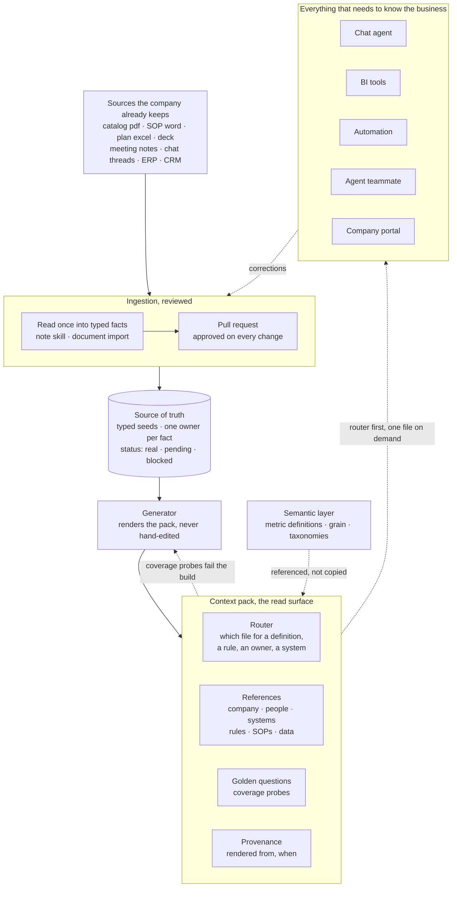

# Context layer

What an agent knows about the business before it answers: the company, the people, the systems, the rules, the SOPs, the data definitions. Written once, read by every agent, tool and page.

The semantic layer defines the numbers. This is the words around them: which system is the source for which fact, who decides what, which business rule overrides general knowledge. It answers nothing on its own; it is what the other components read.

Until recently only the numbers were queryable. An LLM makes the documents a company already keeps count in the same decision: the catalog in PDF, the SOP in Word, the plan in Excel, the deck, the meeting notes, the chat threads.

## Depends on

- **Semantic layer**: metric definitions, grain, timezone, taxonomies. Keep them there and reference them; do not restate a metric here or you get two copies that drift.
- Nothing else is required. The context layer is worth installing before the agents that read it, and it is the cheapest component in the series to start.

## Proven outcome

Same bot, same host, two rounds each, with and without the pack:

| | correct | avg time per question |
|---|---|---|
| with | 6/6, 6/6 | 21 s |
| without | 5/6, 5/6 | 34 s |

Answers were 40% faster, shorter, and cited the rule id. The single miss without the pack was a fact that existed nowhere else: an operator-confirmed warehouse-code to store mapping. Without it the bot answered from a downstream column and could not explain itself.

The same run turned up the more useful finding. The host held the same semantics in three places (a rules folder, a skill file, the report SQL) and two of the copies already disagreed. Writing the layer is what made the disagreement visible.

## Pitfalls

- **Stuffing the prompt instead of curating a pack.** A whole knowledge base pasted into context is expensive, and recall drops in the middle of it. Ship a router the agent always reads plus reference files it opens on demand.
- **Filling a gap from general knowledge.** An agent that invents the missing fact is worse than one that says it is missing. Mark every fact `real` / `pending` / `blocked` and make "answer a gap as a gap" a rule in the router.
- **Hand-editing a generated pack.** The edit is silently lost on the next render. Generate the pack from a source of truth and fail CI when the committed pack is stale or edited, the way a stale lockfile fails.
- **A wiki that decays.** Knowledge rots unless something writes to it on the way past. Give it one ingestion path: a meeting note, a document or a chat export goes in through a skill, the shareable subset updates the source of truth, and every change is a reviewed pull request.
- **One pack for every audience.** Private notes (pricing, performance, personnel) and the shareable subset are not the same document. Separate them at ingestion, not at read time.
- **No coverage test.** Without one you find out the pack is thin when a customer does. Keep a set of golden questions; a non-refusing answer passes.
- **Confusing it with RAG over a document dump.** Retrieval across raw files returns passages. This returns curated, current, cross-linked facts with an owner and a status.

## Pattern

Solid lines are the write path, dashed are reads and feedback. Four rules that hold regardless of vendor:

1. One fact, one home. The pack is generated, never edited in place.
2. Every fact carries a status and an owner. A gap is answered as a gap.
3. The agent loads the router first and one reference file on demand, never the whole pack.
4. Every change is reviewed before it lands, and CI fails a stale pack.

Shape equivalence: Google's Open Knowledge Format (v0.1, 2026-06) is the same idea — one markdown file per concept, YAML frontmatter, cross-linked into a graph agents read. Anything with that shape works.

## Example stack

What we run. Any equivalent works.

| Role | Example |
|---|---|
| Source of truth | typed seeds in the company app, one module per customer; every change a reviewed PR |
| Ingestion | a note skill: the full note stays private, the shareable subset updates the seeds |
| Pack | generated `SKILL.md` router + `references/{company,people,systems,data,rules,sops}.md` + `golden.yaml` + a provenance file |
| Staleness check | CI job that re-renders and fails on a diff |
| Distribution | one script syncs the pack to each bot host; agents load it as a skill |
| Human view | a context tree in the company portal; the same pack pushes to Notion, ClickUp or Jira |

## Setup

- [ ] List what the company already keeps: catalog, SOPs, planning workbooks, decks, meeting notes, chat threads, systems of record.
- [ ] Name one owner per area (company, people, systems, rules, SOPs, data).
- [ ] Write the six reference files. Short. A fact you cannot source is `pending`, not a guess.
- [ ] Write the router: what the pack is, how to use it, the status legend, and "never fill a gap from general knowledge".
- [ ] Move the source of truth into something typed and reviewable; generate the pack from it.
- [ ] Add the staleness check to CI.
- [ ] Write 6-10 golden questions as coverage probes; a non-refusing answer passes.
- [ ] Point one agent at the pack. Measure with and without before installing the next component.
